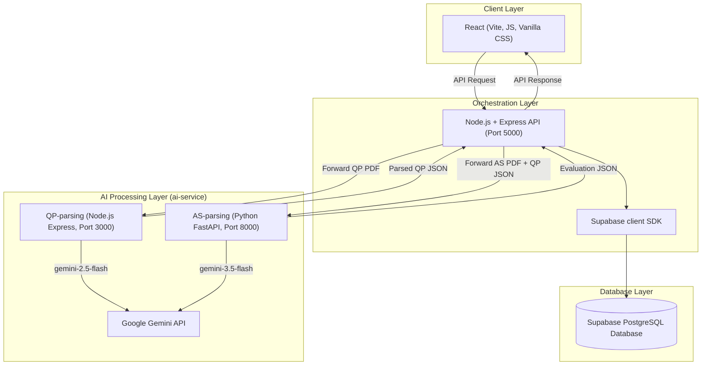
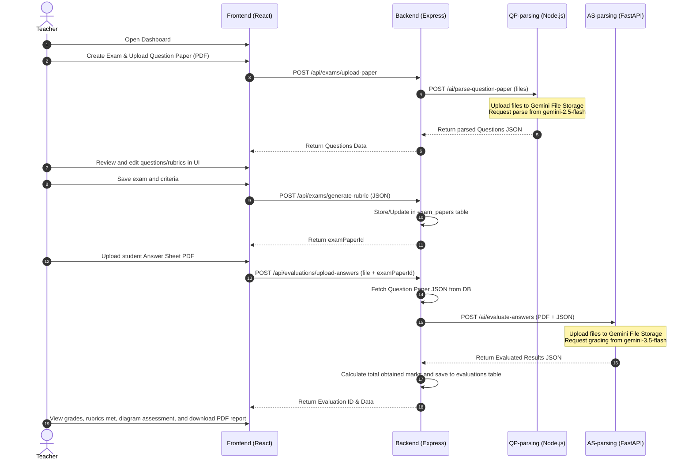
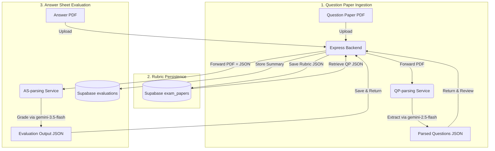

# AI-Powered Intelligent Answer Sheet Evaluation System Using Multimodal AI

An AI-powered web application that automates the evaluation of handwritten subjective answer sheets. The system uses multimodal AI to understand question papers, extract question-wise student answers, interpret diagrams, compare responses against teacher-defined rubrics, and generate transparent marks with reasoning.

The system is designed as an AI-assisted grading platform, allowing teachers to define evaluation criteria while significantly reducing manual evaluation effort.

---

## 🏗️ High-Level Architecture

The system is designed around a clean separation of concerns. The React frontend provides the user interface for teachers. The Node.js Express server orchestrates user actions, file uploads, database queries to Supabase, and requests to the AI processing layer. The AI layer consists of two independent microservices under the `ai-service/` directory, interacting with Google's Gemini API:

1. **`QP-parsing` Service**: A Node.js Express service dedicated to extracting questions, marks, and rubric structures from uploaded question papers.
2. **`AS-parsing` Service**: A Python FastAPI service dedicated to evaluating handwritten student answer sheets against the extracted questions and rubrics.



> [!IMPORTANT]
> **Architectural Separation:** 
> Neither of the AI microservices connects directly to the Supabase database. The Node.js Express backend handles database persistence, fetching the question paper JSON from Supabase, and passing it alongside the student answer sheet PDF to the `AS-parsing` service. This keeps the AI microservices stateless, highly scalable, and independently testable.

---

## 🛠️ Technology Stack

| Layer | Technologies | Key Responsibilities |
| :--- | :--- | :--- |
| **Frontend** | React, Vite, Vanilla CSS, Lucide Icons, React Router DOM, jsPDF | User dashboard, uploading question papers, reviewing and editing rubrics, uploading answer sheets, grading results dashboard, exporting evaluation PDF reports. |
| **Backend (API)** | Node.js, Express.js, `@supabase/supabase-js`, Multer, Axios | Routing endpoints, orchestrating uploads, interacting with Supabase DB client, calculating score aggregates. |
| **AI QP-parsing Service** | Node.js, Express, `@google/genai` SDK | Receives question paper PDFs, uploads them to Gemini File Storage, and calls `gemini-2.5-flash` to extract question details and rubrics into a structured JSON format. |
| **AI AS-parsing Service** | Python, FastAPI, `google-genai` SDK, Pydantic, python-multipart | Receives student answer sheets (PDFs) and question paper JSONs, uploads them to Gemini File Storage, and prompts `gemini-3.5-flash` to execute detailed rubric grading, handwriting OCR, and diagram analysis. |
| **Database** | Supabase (PostgreSQL) | Stores question paper JSON schemas (`exam_papers` table) and student evaluation metrics (`evaluations` table). |

---

## 🔁 User Flow



---

## 📂 Repository Structure

The project repository is organized as a monorepo. Below is the functional mapping of each folder and module:

```
Parakh/                   # Primary application root
  │
  ├── frontend/             # React + Vite web user interface
  │   ├── src/              # Source code directory
  │   │   ├── components/   # Shared UI components (FileUploader, QuestionNode)
  │   │   ├── context/      # State management context (EvaluationContext.jsx)
  │   │   ├── pages/        # Route page views (LandingPage, ReviewPage, UploadAnswersPage, etc.)
  │   │   ├── App.jsx       # Routing configurations using React Router DOM
  │   │   ├── index.css     # Styling definitions (Vanilla CSS)
  │   │   └── main.jsx      # React mounting entrypoint
  │   └── package.json      # Frontend packages and Vite configurations
  │
  ├── backend/              # Node.js Express Orchestration Server
  │   ├── config/           # Database setup (supabase.js client initialization)
  │   ├── controllers/      # Route controllers (examController, evaluationController)
  │   ├── middleware/       # Upload file types validation and global error handlers
  │   ├── routes/           # Express endpoint routes (examRoutes, evaluationRoutes)
  │   ├── services/         # Orchestrator services (aiService, examService, evaluationService)
  │   ├── app.js            # Express application initialization & middleware setup
  │   └── package.json      # Express dependencies (multer, axios, @supabase/supabase-js)
  │
  ├── ai-service/           # Microservices containing Gemini AI logic
  │   ├── QP-parsing/       # Question Paper Parsing service (Node.js Express)
  │   │   ├── controllers/  # Calls @google/genai SDK (gemini-2.5-flash)
  │   │   ├── middlewares/  # Validation & temp files/cloud upload preparation
  │   │   ├── schemas/      # Structured JSON output schemas (newSchema.js)
  │   │   ├── src/index.js  # Server entrypoint running on Port 3000
  │   │   └── package.json  # Dependencies including @google/genai
  │   │
  │   └── AS-parsing/       # Answer Sheet Evaluation service (Python FastAPI)
  │       ├── helpers/      # Evaluation prompts, JSON/PDF validators
  │       ├── pydantic_models/ # Pydantic schemas validating responses (EvaluationOutput)
  │       ├── app.py        # FastAPI entrypoint exposing /ai/evaluate-answers (Port 8000)
  │       └── requirements.txt # Python dependencies (fastapi, google-genai, python-multipart)
  │
  ├── doc/                  # Repository documentation and schema scripts
  │   ├── Architectural docs/ # System diagrams, database schemas, and specifications (answer_sheet_schema.md, question_paper_schema.md, database_design.md, schema.sql)
  │   ├── example JSONs/    # Reference JSON schemas for questions and evaluations
  │   ├── api_endpoints.md  # Detailed REST API endpoint specification
  │   ├── deployment.md     # Production and staging deployment guide
  │   ├── local_development.md # Local boot commands and setup configurations
  │   └── Timeline.md       # Project timeline planning
  │
  ├── SECURITY.md           # Security reporting policies and architectural safety guidelines
  └── README.md             # Top-level repository overview
```

---

## ⚙️ Service Module Responsibilities

### 1. Backend Service (Node.js & Express)
*   **Orchestration API**: Exposes client-facing endpoints for uploading papers (`/api/exams/upload-paper`), saving rubrics (`/api/exams/generate-rubric`), listing exams (`/api/exams/list`), uploading student answers (`/api/evaluations/upload-answers`), and fetching evaluation history (`/api/evaluations/paper/:examPaperId`).
*   **Supabase Integration**: Stores and updates parsed question paper/rubric JSON data in `exam_papers` and grading results in `evaluations`.
*   **Grading Summarization**: Calculates sum of student's marks dynamically across all answer blocks on evaluation store.

### 2. AI Question Paper Parsing Service (`QP-parsing`)
*   **PDF parsing**: Takes uploaded PDFs, saves them to temporary directories, uploads them to the Google Gemini cloud storage, and feeds them into the model.
*   **Gemini Extraction**: Calls the `@google/genai` API with `gemini-2.5-flash` using a strict schema (`newSchema.js`) to parse metadata, instructions, sections, and individual question/rubric details.
*   **Sanitization**: Deletes the local temporary files and cleans up Gemini's cloud storage files upon completing requests.

### 3. AI Answer Sheet Evaluation Service (`AS-parsing`)
*   **FastAPI endpoints**: Exposes `/ai/evaluate-answers` POST route expecting `answer_pdf` and `question_json`.
*   **Pydantic Validations**: Assures that incoming request formats match structural requirements for processing.
*   **Gemini Evaluation**: Uploads files to Gemini File API and sends a query to `gemini-3.5-flash` with the detailed `evaluation_prompt` template. The Gemini model analyzes handwritten content, verifies diagrams, scores individual questions against rubrics, and yields structured results matching `EvaluationOutput` pydantic schema.
*   **Sanitization**: Purges files from Gemini file cloud immediately.

---

## 🧬 AI Pipeline Workflows

The diagram below details the actual state transitions and APIs invoked during document ingestion, rubric storage, and grading processes.



---

## 🗄️ Database Design (Supabase PostgreSQL)

The backend interacts directly with Supabase via `@supabase/supabase-js`. The tables are configured in the `public` schema as follows:

### 1. `exam_papers`
Keeps track of exam questions, marks configurations, and criteria templates.
*   `id` (UUID): Primary key, auto-generated.
*   `pdf_filename` (TEXT): Name of the uploaded question paper file.
*   `parsed_data` (JSONB): Exact parsed questions schema containing metadata, instructions, sections, questions list, marks, and rubrics.
*   `created_at` (TIMESTAMPTZ): Upload date/time.

### 2. `evaluations`
Contains student grading metrics and grading reports generated by the AI services.
*   `id` (UUID): Primary key, auto-generated.
*   `exam_paper_id` (UUID): Foreign key referencing `exam_papers(id)` with cascade deletion.
*   `pdf_filename` (TEXT): Name of the uploaded student answer sheet.
*   `parsed_data` (JSONB): Evaluated results containing detailed student metadata, answer evaluations, marks per rubric, reasonings, and diagrams accuracy reports.
*   `student_name` (TEXT): Student's name.
*   `roll_number` (TEXT): Student's identifier.
*   `exam_code` (TEXT): Exam identifier.
*   `subject` (TEXT): Subject of the exam.
*   `obtained_marks` (NUMERIC): Dynamic sum of marks obtained by the student.
*   `max_marks` (NUMERIC): Total potential marks associated with the exam.
*   `created_at` (TIMESTAMPTZ): Evaluation date/time.

---

## 🚀 Future Features Roadmap

*   **Teacher Adjustments Override**: Add a dedicated UI interface allowing teachers to override AI-graded marks, providing visual comparisons of student handwriting next to evaluated text.
*   **Confidence Metrics**: Provide confidence flags (High, Medium, Low) for each graded question to highlight evaluations needing teacher verification.
*   **Plagiarism Detection**: Cross-sheet analysis comparing answers across a cohort to flag copying patterns.
*   **Multilingual Support**: Multi-language grading models mapping vernacular answers (e.g. Hindi, Tamil, Spanish) back to English rubrics.
*   **Handwriting Legibility Index**: Provide feedback to students concerning the readability of their script.
*   **Analytics dashboard**: Detailed cohort analysis highlighting class averages, distribution curves, and specific topics where students commonly fall short.
