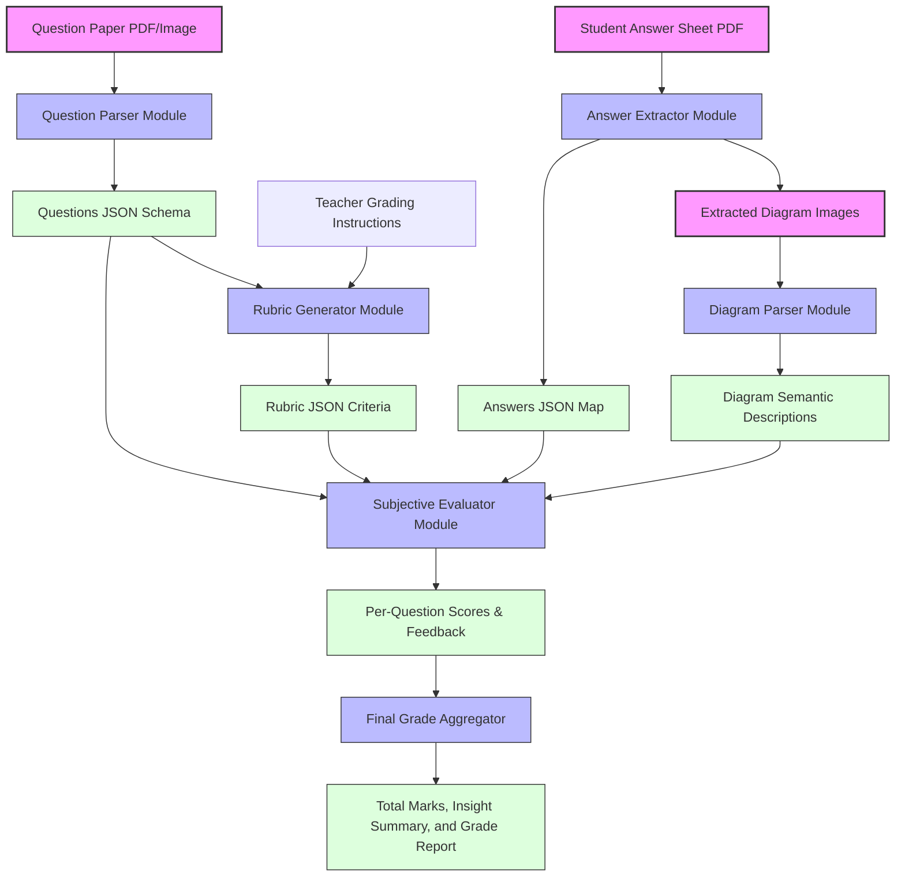

# AI-Powered Intelligent Answer Sheet Evaluation System Using Multimodal AI

An AI-powered web application that automates the evaluation of handwritten subjective answer sheets. The system uses multimodal AI to understand question papers, extract question-wise student answers, interpret diagrams, compare responses against teacher-defined rubrics, and generate transparent marks with reasoning.

The system is designed as an AI-assisted grading platform, allowing teachers to define evaluation criteria while significantly reducing manual evaluation effort.

---

## 🏗️ High-Level Architecture

The system is designed around a clean separation of concerns. The Node.js server orchestrates authentication, business logic, file storage, database operations, and user sessions. The Python service acts as a dedicated AI processing microservice that interacts with Google's Gemini API.

```mermaid
graph TD
    subgraph Frontend [Client Layer]
        React["React + TypeScript (Tailwind CSS, shadcn/ui)"]
    end

    subgraph Backend_App [Orchestration Layer]
        Express["Node.js + Express API"]
        Prisma["Prisma ORM"]
        DB[("PostgreSQL Database")]
        Express --> Prisma
        Prisma --> DB
    end

    subgraph AI_Service [AI Processing Layer]
        FastAPI["Python FastAPI Service"]
        Gemini["Google Gemini API"]
        FastAPI --> Gemini
    end

    React <-->|REST API / JWT| Express
    Express <-->|REST API (JSON / Files)| FastAPI
```

> [!IMPORTANT]
> **Architectural Separation:** 
> The Python service does not connect to the database directly. It receives files or structured JSON payload from the Node.js backend, executes the heavy lifting with Gemini, and yields structured JSON results back to the Node.js API. This keeps the AI service stateless, highly scalable, and independently testable.

---

## 🛠️ Technology Stack

| Layer | Technologies | Key Responsibilities |
| :--- | :--- | :--- |
| **Frontend** | React, TypeScript, Tailwind CSS, shadcn/ui, TanStack Query, React Router | User interface, file uploading, question review, results visualization, dashboard analytics. |
| **Backend (API)** | Node.js, Express.js, TypeScript, Prisma ORM, PostgreSQL, Multer, JWT Authentication | Authentication (JWT), file storage, database persistence, state machine tracking (Exam $\rightarrow$ Paper $\rightarrow$ Rubric $\rightarrow$ Answers $\rightarrow$ Evaluation), routing/endpoints. |
| **AI Service** | Python, FastAPI, Google Gemini API, Pydantic, Pillow, pdf2image, PyMuPDF | Document parsing (PDF to Image), OCR & handwritten text extraction, diagram interpretation, rubric matching, evaluation & grading. |
| **Database** | PostgreSQL, Prisma ORM | Stores structured data (Exams, Questions, Rubrics, Answer Sheets, Evaluated Grades). |

---

## 🔁 User Flow

```mermaid
sequenceDiagram
    autonumber
    actor Teacher
    participant FE as Frontend (React)
    participant BE as Backend (Express)
    participant AI as AI Service (FastAPI)
    
    Teacher->>FE: Login (JWT Authentication)
    Teacher->>FE: Create Exam & Upload Question Paper (PDF/Image)
    FE->>BE: POST /api/exams/upload-paper
    BE->>AI: POST /ai/parse-question-paper
    Note over AI: Parse questions & structure JSON
    AI-->>BE: Return Questions JSON
    BE-->>FE: Return Questions Data
    
    Teacher->>FE: Review Questions & Input Rubric Instructions
    FE->>BE: POST /api/exams/:id/generate-rubric
    BE->>AI: POST /ai/generate-rubric (Instructions + Questions)
    Note over AI: Generate rubric based on instructions
    AI-->>BE: Return Rubric JSON
    BE-->>FE: Return Rubric Data
    
    Teacher->>FE: Upload Student Answer Sheets (PDFs/Images)
    FE->>BE: POST /api/evaluations/upload-answers
    BE->>AI: POST /ai/evaluate-answers (Student Answers + Rubric + Questions)
    Note over AI: Extract answers, parse diagrams, evaluate against rubric, aggregate marks
    AI-->>BE: Return Evaluated Results (Marks, Reasonings, Concepts)
    BE-->>FE: Display Evaluation & Marks Report
    Teacher->>FE: View Report / Manual Marks Override
```



---

## 📂 Repository Structure

The repository is organized as a monorepo. Below is the functional mapping of each folder and module:

```
ai-answer-evaluator/
│
├── frontend/                 # React + Vite client-side user interface
│   ├── src/                  # Core frontend logic (components, hooks, pages, services, styles)
│   ├── public/               # Static assets (icons, images, logos, browser config files)
│   └── package.json          # Frontend packages and script shortcuts
│
├── backend/                  # Node + Express API Gateway (Database, Auth, Orchestration)
│   ├── src/                  # Source files for backend logic
│   │   ├── controllers/      # Handles HTTP request/response parsing and endpoint logic
│   │   ├── routes/           # Express routers mapping API endpoints to controllers
│   │   ├── middleware/       # JWT validation, CORS, error handling, and Multer file upload setup
│   │   ├── services/         # Core logic interfacing with the DB and forwarding requests to AI service
│   │   ├── models/           # Custom data schemas and validations
│   │   ├── config/           # App secrets, DB connections, and environment parameters
│   │   └── app.js            # Express app configuration and initialization
│   └── package.json          # Backend Node.js dependencies and script shortcuts
│
├── ai-service/               # Python FastAPI Microservice (Pure AI & LLM processing)
│   ├── app/                  # Stateless AI processing codebase
│   │   ├── api/              # FastAPI router endpoints called by the Node.js backend
│   │   ├── services/         # Subsystem modular AI agents
│   │   │   ├── pdf_parser.py # Processes question papers and answer sheets (converting pages to image vectors)
│   │   │   ├── ocr.py        # Extracts raw student answers and crops hand-drawn diagram bounding regions
│   │   │   ├── evaluator.py  # Grades answers against rubrics and extracts concept feedback
│   │   │   └── llm.py        # Manages standard Google Gemini API client calls, error handling, and retries
│   │   ├── prompts/          # Managed system prompts and template schemas for LLMs
│   │   ├── schemas/          # Pydantic data schemas validating API request/response payloads
│   │   ├── utils/            # Image processing, bounding box calculations, and cropping utilities
│   │   └── main.py           # FastAPI entrypoint configuration and service listener initialization
│   ├── requirements.txt      # Python runtime dependencies (Pillow, FastAPI, Google GenAI SDK, etc.)
│   └── Dockerfile            # Container configuration for packaging and staging the AI microservice
│
├── docs/                     # Documentation hub (API details, database schemas, prompt logs)
├── .gitignore                # Excluded directories (node_modules, local uploads, keys, envs)
└── README.md                 # Primary developer documentation and overview handbook
```

---

## ⚙️ Service Module Responsibilities

### 1. Backend Service (Node.js & Express)
*   **Authentication:** Handle teacher registration, logins, token encryption, and session verifications using JWT.
*   **Exam Management:** Endpoints for creating exams, fetching dashboard aggregates, deleting exams, and keeping track of evaluation workflows.
*   **Question Paper Handling:** Manage Multer-based uploads, store papers, forward them to the AI Service, and save the structured extracted questions.
*   **Rubric Orchestration:** Accept custom instructions from the teacher, coordinate rubric generation with the AI microservice, and persist the final criteria.
*   **Answer Sheet Processing:** Save student answer submissions, push them to the AI microservice for grading, and persist the returned metadata.
*   **Evaluation Logs:** Store score allocations, detailed AI reasoning blocks, satisfied/unsatisfied criteria lists, and overall grading statistics.

### 2. AI Processing Service (Python & FastAPI)
*   **PDF Parser (`pdf_parser.py`):**
    *   *Input:* Uploaded Question Paper or Answer Sheet PDF
    *   *Output:* High-resolution page images, image grids, and metadata mapping pages.
*   **OCR Engine (`ocr.py`):**
    *   *Input:* Scanned page images and document layout crops
    *   *Output:* Segmented questions or student handwritten texts mapped to page sections and coordinates.
*   **Evaluator (`evaluator.py`):**
    *   *Input:* Extracted student answer, question details, and target rubric instructions
    *   *Output:* Graded score, satisfied rubrics breakdown, missing concept arrays, and visual diagram accuracy reports.
*   **LLM Service Client (`llm.py`):**
    *   *Input:* Prompts, text segments, and structure templates
    *   *Output:* Validated, structured JSON outputs from the Google Gemini API (handling rate limiting, retries, and errors).

---

## 🧬 AI Pipeline Workflows

The diagram below details the chronological processing of files and JSON state transfers inside the AI service during paper ingestion, rubric compilation, and sheet evaluation.



---

## 🗄️ Database Design (Entity Relationship Outline)

The PostgreSQL database maintains relational links across the grading cycle. Below are the core tables represented in the schema:

1.  **`users`**: General user configurations and configurations.
2.  **`teachers`**: Teacher profiles referencing the `users` base configuration.
3.  **`students`**: Student information, IDs, and profiles.
4.  **`exams`**: Specific assessments created by teachers (stores metadata, links to `questions` and `rubrics`).
5.  **`questions`**: Individual items parsed out from the uploaded exam question papers.
6.  **`rubrics`**: Evaluation rulesets linked directly to questions.
7.  **`answer_sheets`**: Entire answer books uploaded for individual students.
8.  **`answers`**: Question-wise student answers extracted from the sheets.
9.  **`evaluations`**: Evaluation outputs detailing final marks, detailed explanations, matched rubric markers, and missing concepts.

---

## 🚀 Future Features Roadmap

*   **Batch Grading:** Bulk upload of multiple answer sheets with queue-based background processing (e.g., BullMQ / Celery).
*   **Teacher Adjustments Override:** User Interface allowing teachers to override AI-graded marks, providing visual comparisons of student handwriting next to evaluated text.
*   **Confidence Metrics:** Provide confidence flags (High, Medium, Low) for each graded question to highlight evaluations needing teacher verification.
*   **Plagiarism Detection:** Cross-sheet analysis comparing answers across a cohort to flag copying patterns.
*   **Multilingual Support:** Multi-language grading models mapping vernacular answers (e.g. Hindi, Tamil, Spanish) back to English rubrics.
*   **Handwriting Legibility Index:** Provide feedback to students concerning the readability of their script.
*   **Analytics dashboard:** Detailed cohort analysis highlighting class averages, distribution curves, and specific topics where students commonly fall short.
*   **Export Formats:** Export final student evaluations to PDF reports or CSV/Excel grade books.
*   **LLM Model Registry:** An abstraction layer allowing admins to toggle between different foundation models (Gemini-1.5-Pro, GPT-4o, Claude 3.5 Sonnet) based on cost or accuracy needs.
